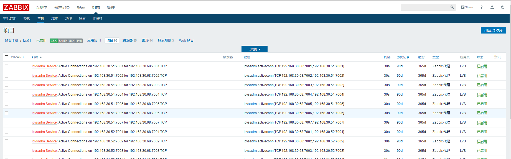

zabbix-ipvsadm
====
由 [zabbix_ipvsadm](https://github.com/shinonome/zabbix_ipvsadm) 修改而来

Usage
----
* 将ipvsadm_discover.sh 和ipvsadm.py 放置于/etc/zabbix目录中
* 将ipvsadm.conf放置于/etc/zabbix/zabbix_agentd.conf.d目录中
* 允许Zabbix用户使用ipvsadm命令（不允许输入密码）
```
sed -i '/secure/a\Defaults:zabbix !requiretty' /etc/sudoers
sed -i '/^root/a\zabbix  ALL=(ALL)   NOPASSWD: /sbin/ipvsadm' /etc/sudoers

```
* 重启zabbix-agent并且测试
```
service zabbix-agent restart

zabbix_get -s IPADDRESS -k ipvsadm.discovery
```
* 如果成功则在Zabbix server的Web界面中导入Template_LVS_connections.xml

修改说明：
----
由于 [zabbix_ipvsadm](https://github.com/shinonome/zabbix_ipvsadm)中的ipvsadm_discover.sh脚本获取的格式并非JSON无法被Zabbix所解析，所以进行修改以便zabbix可以正常获取数据


